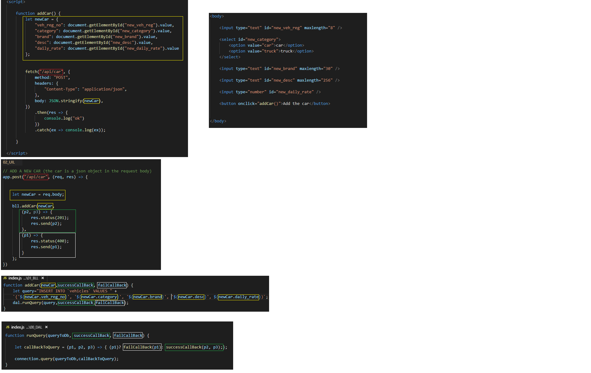
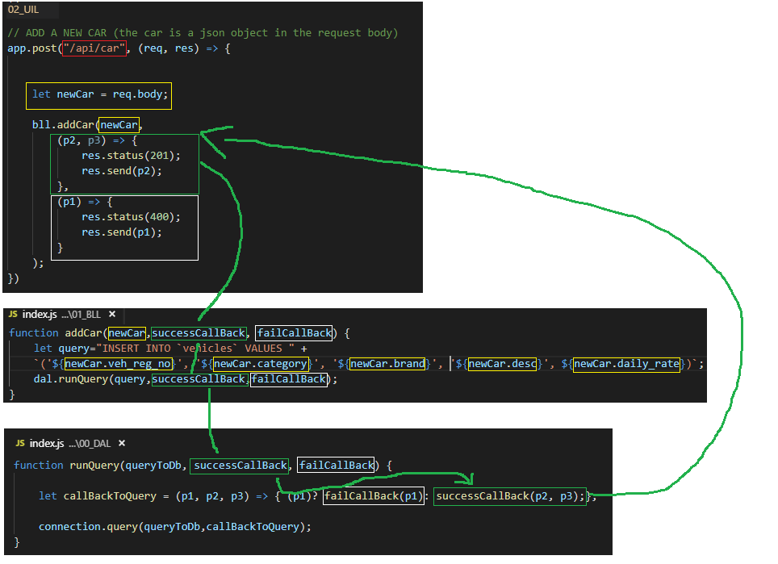

# N-Tier nodel - Nodejs App
***
### First request:

***
### After First request:

***


# Creatung the project
* Create a new folder named `App Code`
* Init this folder as a npm app
```
npm init
```
* Add to this app the following npm packages:
```
npm i -s express
npm i -s body-parser
npm i -s mysql
```
* Create the following sql script, to use it later from the js code:
```sql
-- Create `rental_db` db
CREATE DATABASE cars;
USE cars;

-- Create `vehicles` table
DROP TABLE IF EXISTS `vehicles`;
CREATE TABLE `vehicles` (
   `veh_reg_no`  VARCHAR(8)    NOT NULL,
   `category`    ENUM('car', 'truck')  NOT NULL DEFAULT 'car', 
   `brand`       VARCHAR(30)   NOT NULL DEFAULT '',
   `desc`        VARCHAR(256)  NOT NULL DEFAULT '',
   `daily_rate`  DECIMAL(6,2)  NOT NULL DEFAULT 9999.99,
   PRIMARY KEY (`veh_reg_no`),
);
 
-- Inserting test records
INSERT INTO 'vehicles' VALUES
   ('SBA1111A', 'car', 'NISSAN SUNNY 1.6L', '4 Door Saloon, Automatic', 99.99),
   ('SBB2222B', 'car', 'TOYOTA ALTIS 1.6L', '4 Door Saloon, Automatic', 99.99),
   ('SBC3333C', 'car', 'HONDA CIVIC 1.8L',  '4 Door Saloon, Automatic', 119.99),
   ('GA5555E', 'truck', 'NISSAN CABSTAR 3.0L',  'Lorry, Manual ', 89.99),
   ('GA6666F', 'truck', 'OPEL COMBO 1.6L',  'Van, Manual', 69.99);


-- Reading records
SELECT * FROM `vehicles`;
```

* Add to the `App Code` folder, the following sub-folders:
```
00_DAL
01_BLL
02_UIL
```

* Add to `00_DAL`, a file named `index.js`, that contains all the generic DDL + DML operations


* Add to `01_BLL`, a file named `index.js`, that contains all the logic operations (and uses the DAL)


* Add to `02_UIL`, a file named `controller.js`, that contains the express server (and uses the BLL)


*  Add to `02_UIL`, a new subfolder named `views`
* Add to `02_UIL/views`, a file named `index.html`, that will be served to the user by the express server
* Add to `02_UIL/views`, a file named `app.js`, that will be served to the user by the express server
* Add to `02_UIL/views`, a file named `style.css`, that will be served to the user by the express server
# How Bll calls DAL (with callbacks)
.png)

# JS to UIL to Bll to DAL (with callbacks)



# Callback from UIL to Bll to DAL
